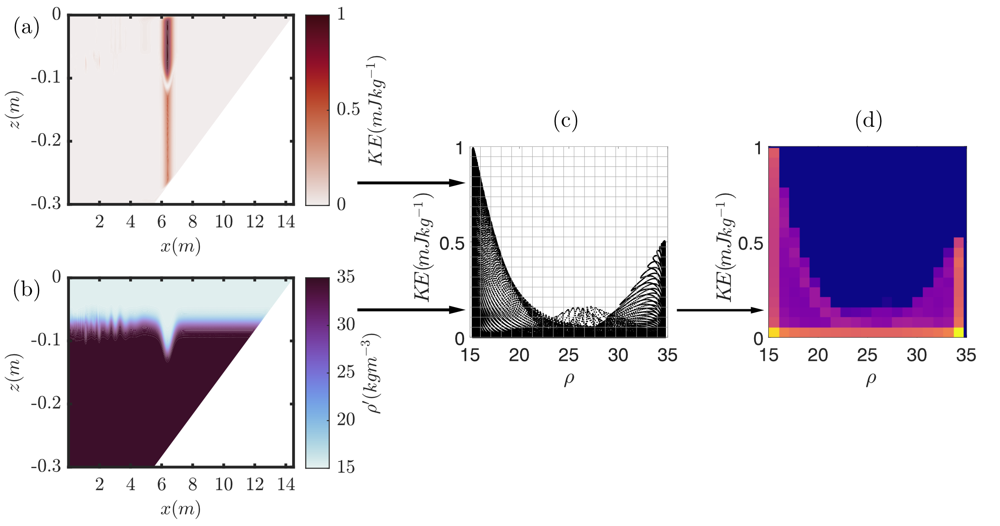

# USP (User-controlled Scatter Plots) for SPINS
Extended mixing diagnostics in MATLAB for SPINS

## Introduction to method (what is USP, why do we want to use it?)

USP (User-controlled Scatter Plots), or joint probability plots tell us where two variables overlap, so we can find out if, when and where we get combinations of two variables. 

USP is a statistical method (it's Baysean P(A|B)) of analysing a physical domain by decomposing into a 2-dimensional paired histogram of two fluid properties. In this case, one property is usually a physical property of the fluid (density, temperature, salinity, tracer concentration), and the other a measure of flow (speed, Kinetic Energy, vorticity, enstrophy, dissipation). 

Typically, the sorting algorithm can be used to investigate mixing, telling how much of each type of energy there is at each timestep, and how energy moves between those types (see [plot\_diagnos.m](https://github.com/ddeepwel/SPINSmatlab/blob/master/plotting/plot_diagnos.m) in SPINSmatlab). Unlike other methods typically used to investigate mixing, it is primarily qualitative, but it informs us where mixing takes place, and the fluid parcels that have undergone mixing, as well as the fact we can change the physical domain of interest easily (which we can't do for a sorting algorithm). 

## Research questions available using this method
- Tracing how fluid parcels change as they move through physical space
- Tagging of fluid parcels - we can map back from USP to physical space
- Understanding covariance of fluid properties

## Features \& Usage

  USP_2D/USP_3D

[2D MATLAB Tool](usp_2d.m)

[3D MATLAB Tool](usp_3d.m)

MATLAB tool for calculating the USP histograms for 2D//3D simulations, mapped or unmapped grids (easy to adjust parameters and run local analysis) - mapped only for 2D. 

Both USP\_2d, USP\_3d have the same input variables (wich broadly match their equivalents in USP_to_physical):
- ii is the output number,
- var1 is the first variable (USP x axis),
- var2 second variable (USP y axis),
- spat\_lims is the spatial region to plot \[xmin xmax zmin zmax\]
- var\_lims is the limits of the variables (essentially axis limits of USP), NOTE this is \[var2min var2max var1min var2max\], and can be set only for var2. It's probably usually good practice to set the var\_lims, as SPINS often outputs one or two super off the scale values which just drown out any other data (this is just like we usually would set the caxis).
- doPlot is a boolean switch to make plots, or to output data. 

MATLAB files are set up to use as variable 1, density, salinity, or any other SPINS direct output file. As variable 2, it can do KE, speed, enstrophy, vorticity, dissipation, or any other SPINS direct output file. 

  USP_to_physical

  
[2D MATLAB Tool](usp_to_physical.m)

[3D MATLAB Tool](usp_to_physical_3d.m)

MATLAB tool to identify what fluid in physical space meets the criteria identified from a USP histogram.

In interactive mode (Region variable not input) USP\_to\_physical (2D only) will present to you the output from USP\_mapped (it in fact simply calls that function), prompting you to select the Region of Interest in the USP histogram (by clicking two opposite corners of the rectangle). It will then plot the fluid within this region of interest for both variables and the USP OR output the boolean mask for the ROI.

- ii is the output number,
- var1 is the first variable (USP x axis),
- var2 second variable (USP y axis),
- spat\_lims is the spatial region to plot \[xmin xmax zmin zmax\]
- var\_lims is the limits of the variables (essentially axis limits of USP), NOTE this is \[var2min var2max var1min var2max\], and can be set only for var2. It's probably usually good practice to set the var\_lims, as SPINS often outputs one or two super off the scale values which just drown out any other data (this is just like we usually would set the caxis).
- Region is the Region of Interest to be plotted

For the following command: 
`>> usp_to_physical(67, 'rho', 'KE', [5.5 7], [0 0.005 -0.0095 0.0095]);`

A region of interest can be isolated interactively:

MATLAB files are set up to use as variable 1, density, salinity, or any other SPINS direct output file. As variable 2, it can do KE, speed, enstrophy, vorticity, dissipation, or any other SPINS direct output file. N.B.  when we use a square measure you do essentially squash low values together, and stretch the high values togehter, so consider this. 
There's also an "isInvert" switch in qsp\_to\_physical which needs to be manually changed in the code, if it's set to true it shows us the physical space which is outside the highlighted usp space - in some ways it's "What part of the flow isn't interesting"

TODO: Add a schematic here
TODO: qsp\_to\_physical to work with the csv read in from SPINSqsp

    SPINS tools

  
- [SPINS qsp](https://git.uwaterloo.ca/SPINS/SPINS_main/-/tree/master/src/cases/qsp) - A c++ tool for calculating USP within the SPINS architecture. Best if using large outputs, and/or 3D simulations. 
- [UNDER DEVELOPMENT] SPINS qsp read tool - Tool to read the .csv output by the SPINS qsp
- [UNDER DEVELOPMENT] MATLAB QSP Statistics tool. 

  3D Plotting

[Make isosurface files](./plot_3d/make_usp_isos.m)

[Plot isosurface plots](./plot_3d/plot_usp_iso.m)

Produce isosurface plots outlining the edges of the Region of Interest highlighted in usp_to_physical_3d - specifically for 3D plots. These visualsisations can be explored alongside the more quantitative plots made by that function, to understand better the distribution of regions of interest. Example plot follows, with red indicating ROI boundaries, and black indicating a reference isopycnal. 

Production in a two-step process
1. make\_usp\_isos outputs a .mat file with a boolean grid of the isosurface based on the same grid as xgrid/ygrid/zgrid. This probably should be run on a computing system capable of handling the 3D data
2. plot\_usp\_iso plots the outputs of the previous step, best run on a local machine for good graphics rendering! 

 2D Plotting

[Timestep Comparison](./plot_2d/usp_phys_plotter.m)

[Inter-simulation Comparison](./plot_2d/usp_phys_plotter_comb.m)

[Example Script](./Plot_All_USP_Phys.m)

Produces USP plots for publication, such as figures 3 and 4 of USP paper. Example script to run both parts is provided in the Plot\_All\_USP\_Phys.m script. This is a good starting point for analysis of 2D simulation data, and comparing between simulations. 

 Empirical Orthogonal Functions

[USP EOFs](./EOF/usp_eof.m)

Produces EOF analysis of the QSPs, in particular an analysis of the error maps as in Shaw \& Stastna (2019), for the purpose of improved choosing of appropriate time steps of interest.

### Choosing the criterion for USP space
1. Based on the initial conditions (focus on the region that has changed)
2. An interesting feature on the USP space
3. Some kind of pre-determined criteria (exceeding a threshold)
Perhaps may be a bit hand-wavey (we know that super high KE values are probably bs, low KE is boring). 

## See also:
- [SPINS\_main](https://git.uwaterloo.ca/SPINS/SPINS_main.git)
- [SPINSmatlab](https://github.com/ddeepwell/SPINSmatlab.git)
- [SPINS\_energetics](https://github.com/HartharnSam/SPINS_energetics) - Advanced analytics of energetics output by MATLAB

## Development

## References
Penney et al., 2020; Diapycnal mixing of passive tracers by Kelvin-Helmholtz instabilities. JFM, [doi:10.1017/jfm.2020.483](https://doi.org/10.1017/jfm.2020.483)
Shaw \& Stastna, 2019; Feature identification in time-indexed model output. PLOS ONE, [doi:10.1371/journal.pone.0225439](https://doi.org/10.1371/journal.pone.0225439)
